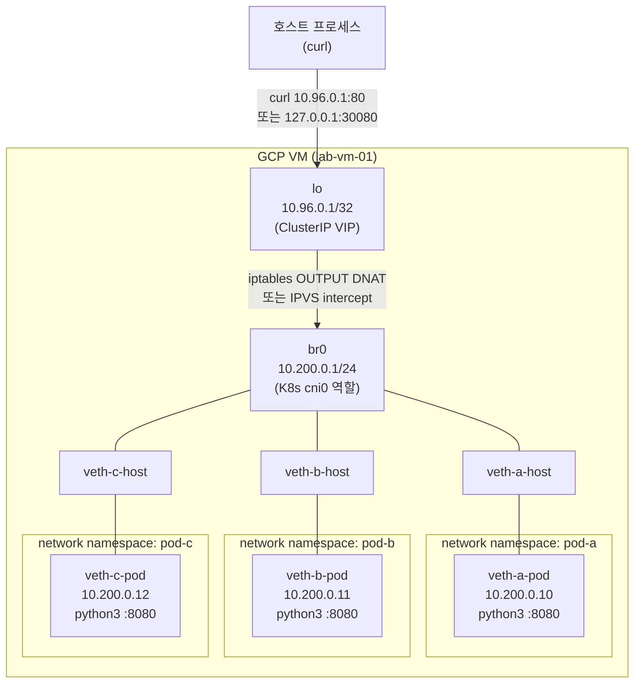
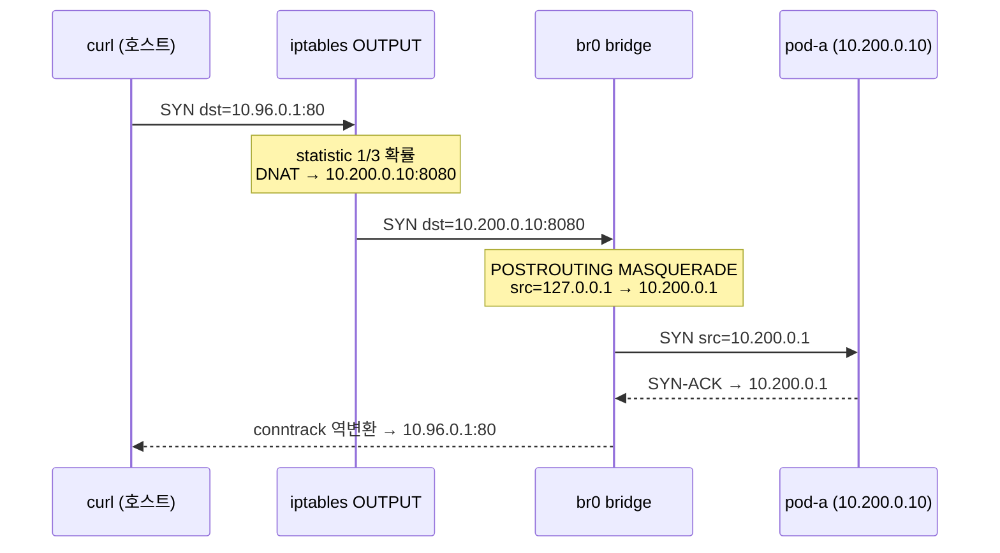

# 01. K8s Service 가상 구현

> K8s의 ClusterIP / NodePort는 iptables DNAT와 IPVS라는 두 가지 커널 기능으로 구현된다. 이 실습은 GCP VM 위에서 동일한 동작을 직접 재현하고, 서비스 수 증가에 따른 두 방식의 제어 평면 성능 차이를 수치로 검증한다.

---

## 아키텍처

### 실습 토폴로지



### iptables 패킷 흐름 (ClusterIP)



---

## 왜 이 주제를 다루는가

K8s Service의 두 구현 방식은 면접에서 자주 등장하는 주제다.

- **iptables 방식**: kube-proxy 기본값(~1.29). 서비스당 3개 DNAT 규칙, 패킷마다 O(N) 순차 탐색. 서비스 수가 늘수록 선형으로 느려짐.
- **IPVS 방식**: kube-proxy `--proxy-mode=ipvs`. 해시 테이블 기반 O(1) 룩업. 대규모 클러스터에서 성능 우위.

---

## 핵심 기술

| 기술 | 역할 |
|------|------|
| `ip netns` | 커널 network namespace로 Pod 격리 시뮬레이션 |
| Linux bridge (`br0`) | CNI 브리지(cni0/cbr0) 역할, Pod 간 L2 통신 |
| veth pair | 호스트 ↔ namespace 가상 이더넷 터널 |
| iptables `statistic` | 랜덤 확률 기반 부하분산 (DNAT와 조합) |
| iptables DNAT | 패킷 목적지 IP/포트 변환 (ClusterIP → Pod IP) |
| IPVS NAT 모드 | 해시 테이블 기반 부하분산, round-robin 스케줄러 |
| `nf_conntrack` | NAT 세션 추적, 응답 패킷 역변환 |

---

## 실습 구성

### 스크립트 실행 순서

```bash
# root 권한 필요
sudo bash scripts/01-setup-namespaces.sh   # namespace + bridge + 서버 시작
sudo bash scripts/02-iptables-demo.sh      # iptables ClusterIP/NodePort 시연
sudo bash scripts/03-ipvs-demo.sh          # IPVS로 동일 시나리오 재구현
sudo bash scripts/04-benchmark.sh          # 성능 비교 벤치마크
sudo bash scripts/cleanup.sh              # 리소스 정리
```

### 네트워크 주소 설계

| 역할 | 주소 |
|------|------|
| ClusterIP VIP | 10.96.0.1:80 (lo에 바인딩) |
| NodePort | 127.0.0.1:30080 (iptables) / 10.178.0.2:30080 (IPVS) |
| pod-a | 10.200.0.10:8080 |
| pod-b | 10.200.0.11:8080 |
| pod-c | 10.200.0.12:8080 |
| br0 (gateway) | 10.200.0.1/24 |

---

## iptables vs IPVS 비교

### 동작 방식

| 항목 | iptables | IPVS |
|------|----------|------|
| 구조 | PREROUTING/OUTPUT 체인에 DNAT 규칙 삽입 | 가상 서버 + 실제 서버 테이블 (해시) |
| 패킷 룩업 | O(N) 순차 탐색 | O(1) 해시 테이블 |
| 부하분산 | `statistic` 모듈 랜덤 확률 | rr/wrr/sh 등 다양한 스케줄러 |
| 분산 정확도 | 확률적 (소수 요청 시 편차 발생) | 결정론적 round-robin |
| 규칙 업데이트 | 전체 체인 재작성 (원자적) | 개별 항목 추가/삭제 가능 |
| 연결 지속성 | conntrack 기반 | 내장 세션 테이블 |

### 벤치마크 결과 (제어 평면 — 규칙 관리 속도)

실측 환경: GCP e2-standard-2, Ubuntu 22.04, 커널 6.8.0-1060-gcp (2026-06-22)

#### iptables (서비스당 DNAT 규칙 3개)

| 서비스 수 | 총 규칙 수 | restore 시간 | save 시간 |
|-----------|-----------|-------------|----------|
| 1 | 3 | 33ms | 28ms |
| 100 | 300 | 44ms | 34ms |
| 1000 | 3,000 | 168ms | 105ms |
| 5,000 | 15,000 | **728ms** | **408ms** |

#### IPVS (서비스당 VIP 1개 + real server 3개)

| 서비스 수 | 총 항목 수 | add 시간 | list 시간 |
|-----------|-----------|---------|----------|
| 1 | 4 | 22ms | 19ms |
| 100 | 400 | 43ms | 27ms |
| 1000 | 4,000 | 255ms | 88ms |
| 5,000 | 20,000 | 1,260ms | **366ms** |

#### 해석

- **iptables-restore가 빠른 이유**: 전체 규칙을 단일 배치 syscall로 로드 (원자적 락 → 해제). 반면 `ipvsadm -R`은 항목당 netlink 메시지 발생.
- **실제 kube-proxy IPVS 모드**는 netlink 배치 API를 사용해 ipvsadm보다 훨씬 빠름.
- **핵심 차이는 데이터 평면**: 5,000개 서비스 환경에서 iptables는 패킷마다 최대 15,000개 규칙을 순차 탐색. IPVS는 해시 테이블로 O(1) 룩업 — 서비스 수와 무관하게 일정.
- **iptables 728ms의 의미**: 서비스 5,000개 클러스터에서 새 Pod가 뜨거나 기존 Pod가 죽을 때마다 kube-proxy가 15,000개 규칙을 전부 재작성하는 데 728ms 걸림. 이 시간 동안 iptables 락이 걸려 다른 규칙 변경이 불가.

---

## 트러블슈팅 요약

| 증상 | 원인 | 해결 |
|------|------|------|
| NodePort curl hang (127.0.0.1:30080) | src=127.0.0.1 패킷이 br0으로 라우팅될 때 martian source로 드롭 | `sysctl net.ipv4.conf.all.route_localnet=1` |
| NodePort curl → 즉시 Connection refused | curl이 IPv6(::1)로 fallback; iptables IPv4 규칙 미적용 | `curl -4` 또는 `curl http://127.0.0.1:...` 명시 |
| IPVS test fail "Permission denied" | `ipvsadm` sudo 없이 실행 | `sudo ipvsadm ...` |

상세 트러블슈팅 로그: [PROGRESS.md](./PROGRESS.md)

---

## 학습 키워드

- `ip netns` / `ip link add type veth` / `ip link set netns`
- `iptables -t nat -A OUTPUT/PREROUTING -j DNAT`
- `iptables -m statistic --mode random --probability`
- `iptables -t nat -A POSTROUTING -j MASQUERADE`
- `net.ipv4.conf.all.route_localnet` — martian source 허용
- `ipvsadm -A/a -t VIP:PORT -s rr -r REAL:PORT -m` — NAT 모드
- `ipvsadm -R` — 배치 복원 (stdin)
- O(N) vs O(1) 룩업, control plane vs data plane 성능
