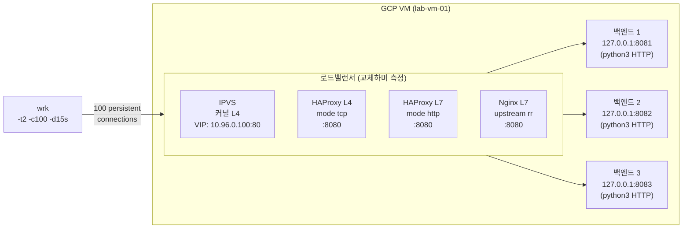
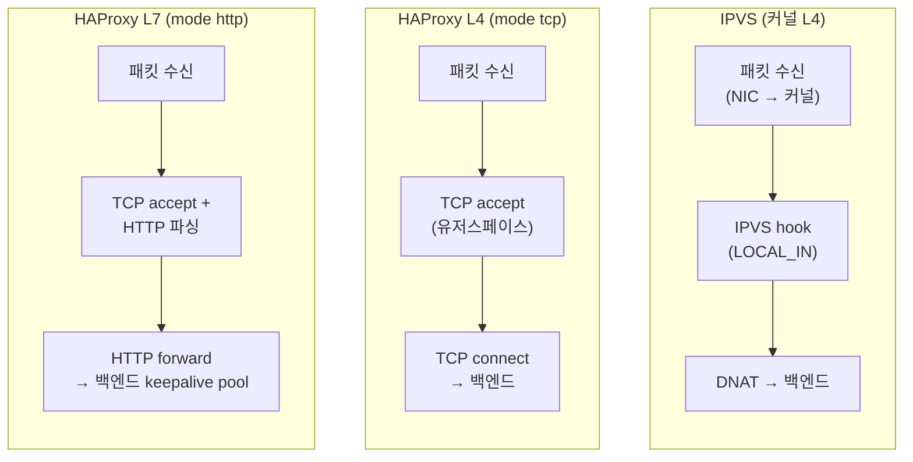

# 02. L4/L7 로드밸런서 비교

> IPVS(커널 L4), HAProxy L4, HAProxy L7, Nginx L7을 동일한 3개 백엔드와 동일한 부하로 벤치마크해, 계층별 처리 방식 차이를 RPS/레이턴시 수치로 검증한다.

---

## 아키텍처

### 실습 토폴로지



### 패킷 처리 계층 비교



---

## 왜 이 주제를 다루는가

K8s의 로드밸런싱 구조는 계층별로 다른 컴포넌트가 담당한다.

- **kube-proxy IPVS 모드**: 커널 네트워크 스택에서 패킷을 가로채 해시 테이블로 O(1) 목적지 변환. 유저스페이스 복사 없음.
- **MetalLB / Cloud LB**: L4 TCP 레벨 프록시.
- **Ingress (Nginx, HAProxy, Envoy)**: HTTP 헤더를 분석해 경로/호스트 기반 라우팅. 인증, 압축, TLS 종료 등 부가 기능.

IPVS가 왜 빠른지, L7이 L4보다 느리지만 무엇을 얻는지를 수치로 직접 확인한다.

---

## 핵심 기술

| 기술 | 역할 |
|------|------|
| IPVS NAT 모드 | 커널 내 패킷 DNAT, 유저스페이스 TCP 스택 우회 |
| `ipvsadm -A/a -t VIP:PORT -s rr -r REAL:PORT -m` | 가상 서버 + real server 등록 |
| HAProxy `mode tcp` | L4 TCP 프록시, HTTP 파싱 없음 |
| HAProxy `mode http` | L7 HTTP 프록시, 요청 단위 분산, 백엔드 keepalive 풀 |
| Nginx `upstream` | L7 HTTP 프록시, round-robin upstream |
| `wrk -t2 -c100 -d15s --latency` | 2 스레드 100 연결 15초 부하 |

---

## 실습 구성

### 스크립트 실행 순서

```bash
# 백엔드 3대 시작 (root 불필요)
bash scripts/01-setup-backends.sh

# 벤치마크 4종 순서 실행 (IPVS/HAProxy는 sudo 필요)
sudo bash scripts/02-run-benchmarks.sh

# 정리
sudo bash scripts/cleanup.sh
```

### 네트워크 주소 설계

| 역할 | 주소 |
|------|------|
| IPVS VIP | 10.96.0.100:80 (lo에 임시 추가) |
| HAProxy / Nginx 프런트엔드 | 127.0.0.1:8080 |
| 백엔드 1/2/3 | 127.0.0.1:8081 / 8082 / 8083 |

---

## 벤치마크 결과

실측 환경: GCP e2-standard-2 (2vCPU/8GB), Ubuntu 22.04, 커널 6.8.0-1060-gcp  
측정 조건: `wrk -t2 -c100 -d15s --latency` (2 스레드, 100 persistent connections, 15초)  
측정일: 2026-06-22

| 방식 | RPS | p50 | p75 | p90 | p99 | timeout |
|------|----:|----:|----:|----:|----:|--------:|
| IPVS (커널 L4) | **2,075** | **7ms** | 10.83ms | 22.26ms | 485ms | 0 |
| HAProxy L7 (mode http) | 1,903 | 11.49ms | 439ms | 842ms | 1.19s | 96 |
| Nginx L7 (upstream) | 1,894 | 14.48ms | 445ms | 833ms | 1.13s | 55 |
| HAProxy L4 (mode tcp) | 1,648 | 12.28ms | 352ms | 830ms | 1.26s | 98 |

### 결과 해석

#### 1. IPVS가 가장 빠른 이유

IPVS는 커널의 `LOCAL_IN` 훅에서 패킷의 목적지만 DNAT 변환한다. 로드밸런서 자체가 TCP 연결을 맺지 않으므로 유저스페이스↔커널 데이터 복사가 없다. 패킷 처리 경로가 짧아 p50=7ms 달성.

#### 2. HAProxy L4 < HAProxy L7 — 직관에 반하는 결과

wrk는 100개 TCP 연결을 15초 내내 유지한다(persistent connection). HAProxy `mode tcp`는 TCP **연결** 단위로 라운드로빈하므로, 초반에 100개 연결을 3개 백엔드에 분배하면 이후 모든 요청이 그 연결을 그대로 사용한다. 즉 **per-connection** 분산.

반면 HAProxy `mode http`는 HTTP **요청** 단위로 분산하고 백엔드에 keepalive 연결 풀을 유지한다. 요청마다 유휴 백엔드로 보낼 수 있어 **per-request** 분산이 가능하다. 결과적으로 백엔드 활용률이 높고 RPS가 더 높게 나온다.

> 실무 교훈: L4 TCP 프록시가 L7보다 항상 빠른 것은 아니다. 워크로드가 persistent HTTP인 경우 L7 프록시의 keepalive 풀 관리가 성능 우위를 만들 수 있다.

#### 3. HAProxy L7 ≈ Nginx L7

두 구현 모두 HTTP/1.1 파싱 + 요청 단위 분산 + 백엔드 keepalive 풀을 제공한다. 차이(1,903 vs 1,894)는 측정 오차 범위 내.

#### 4. p99 격차

IPVS의 p99=485ms vs 유저스페이스 LB p99≈1.1~1.3s. 유저스페이스 LB는 100 연결을 모두 처리하는 단일 프로세스이므로, 부하 집중 시 큐 지연이 길어진다. IPVS는 연결당 커널 처리이므로 tail latency가 낮다.

---

## 트러블슈팅 요약

| 증상 | 원인 | 해결 |
|------|------|------|
| 이전 측정 결과 오염 (모두 ~1,842 RPS) | 수동으로 띄운 haproxy PID가 `/tmp/hp.pid`가 아닌 다른 파일에 저장돼 종료되지 않음 | `sudo fuser -k 8080/tcp` + `sudo pkill -9 haproxy`로 강제 종료 후 재측정 |
| `cat > /tmp/hp-l7.cfg` → Permission denied | 이전 `sudo bash` 실행으로 파일 소유자가 root | `sudo rm -f /tmp/hp-l7.cfg` 후 재작성 |
| `nginx -s quit` → `open() "/run/nginx.pid" failed` | nginx를 `-c /tmp/ng.conf`로 시작했지만 quit 시 `-c` 미지정 → 기본 pid 경로 참조 | `sudo kill $(cat /tmp/lb-nginx.pid)` 사용 |

상세 트러블슈팅 로그: [PROGRESS.md](./PROGRESS.md)

---

## 학습 키워드

- IPVS NAT 모드: `LOCAL_IN` 훅, DNAT only, 유저스페이스 우회
- HAProxy `mode tcp` vs `mode http`: per-connection vs per-request 분산
- HAProxy `balance roundrobin`, Nginx `upstream` round-robin
- wrk persistent connection과 LB 계층 간 상호작용
- `ipvsadm -A/a -t VIP -s rr -r REAL -m` (NAT/Masq 모드)
- `ip addr add VIP/32 dev lo` — 루프백에 VIP 추가
- `net.ipv4.conf.all.route_localnet=1` — IPVS + 로컬 백엔드 연동 필수
- `ss -tlnp` — 포트 점유 프로세스 확인
- `sudo fuser -k PORT/tcp` — 특정 포트 강제 종료
