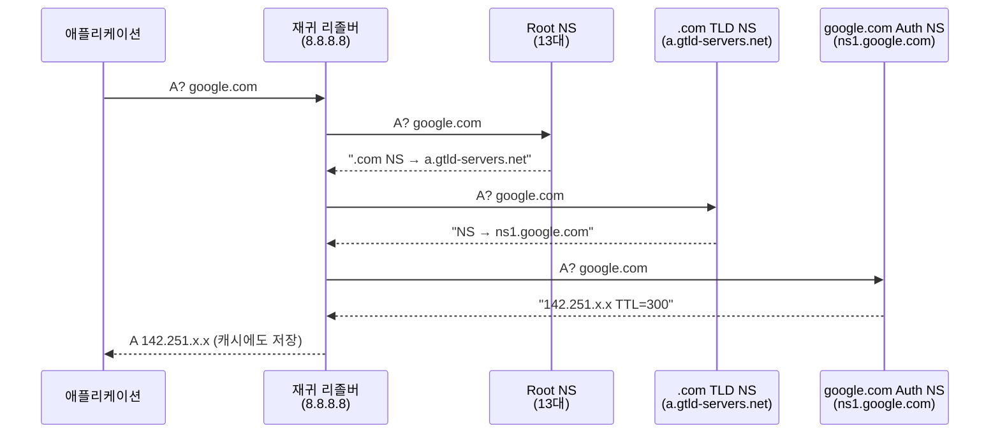
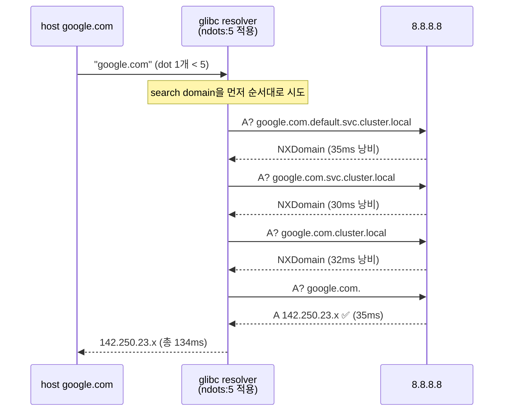
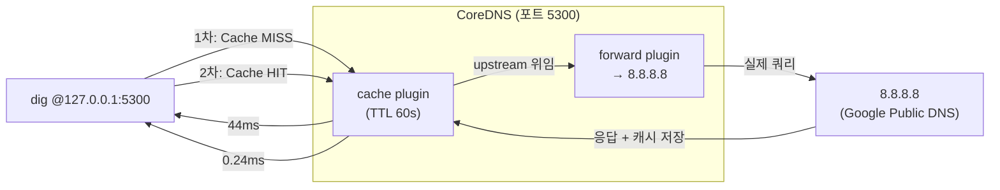

# 03. DNS 동작 원리 & CoreDNS 심층 분석

> 재귀/반복 조회 흐름을 tcpdump로 직접 추적하고, K8s ndots:5 기본값이 일으키는 불필요한 쿼리를 패킷 레벨에서 측정한다. CoreDNS를 직접 실행해 캐시 효과를 수치로 검증한다.

---

## 아키텍처

### 재귀(Recursive) vs 반복(Iterative) 조회



VM에서 `tcpdump`로 보이는 것은 **App ↔ 8.8.8.8** 단 1번의 왕복뿐이다. Root/TLD/Auth 간 반복 조회는 8.8.8.8 내부에서 처리된다.

### ndots:5 쿼리 흐름



FQDN(`google.com.` 끝에 점)을 사용하면 search domain 시도 없이 바로 1번 쿼리로 해결된다.

### CoreDNS 캐시 구조



---

## 왜 이 주제를 다루는가

K8s에서 DNS는 성능 병목의 숨은 원인이 되는 경우가 많다.

- **ndots:5**: K8s pod의 `/etc/resolv.conf` 기본값. `curl http://svc/` 한 번에 DNS 쿼리가 최대 6회(search domain 수 + 1) 발생. 외부 도메인 호출이 많은 애플리케이션에서 레이턴시를 수십~수백ms 늘린다.
- **CoreDNS**: kube-dns를 대체한 K8s 기본 클러스터 DNS. Go 기반 플러그인 체인 아키텍처. `cache`, `rewrite`, `forward`, `health`, `ready`, `metrics` 등 플러그인을 Corefile 한 파일로 구성.
- **캐시**: CoreDNS cache 플러그인은 응답을 메모리에 저장해 동일 쿼리를 업스트림 왕복 없이 응답. 이번 실측에서 44ms → 0.24ms (180배 단축).

---

## 핵심 기술

| 기술 | 역할 |
|------|------|
| `dig` | DNS 조회 도구. 기본적으로 resolv.conf ndots 무시 (순수 쿼리 테스트용) |
| `host` | glibc resolver 경유. ndots/search domain 실제 동작 재현 |
| `tcpdump port 53` | DNS UDP/TCP 패킷 캡처 |
| CoreDNS `forward` | 업스트림 리졸버로 쿼리 위임 |
| CoreDNS `cache` | 응답 TTL 범위 내 메모리 캐시 |
| CoreDNS `log` | 쿼리별 latency와 rcode 로깅 |
| `/etc/resolv.conf` | `nameserver`, `search`, `options ndots:N` 설정 |

---

## 실습 구성

### 스크립트 실행 순서

```bash
# 1. DNS 재귀 조회 패킷 관찰
sudo bash scripts/01-dns-trace.sh

# 2. ndots:5 불필요한 쿼리 계수 (resolv.conf 임시 변경 → 자동 복원)
sudo bash scripts/02-ndots-demo.sh

# 3. CoreDNS 캐시 MISS vs HIT 레이턴시 비교
bash scripts/03-coredns-cache.sh

# 정리
sudo bash scripts/cleanup.sh
```

---

## 실험 결과

실측 환경: GCP e2-standard-2, Ubuntu 22.04, DiG 9.18.39, CoreDNS 1.11.3 (2026-06-22)

### 실험 1: 재귀 조회 관찰

```
Out: 10.178.0.2.58506 > 8.8.8.8.53: A? google.com.
In:  8.8.8.8.53 > 10.178.0.2.58506: A 142.251.169.x × 6
RTT: 35ms
```

단 1번의 쿼리/응답으로 완료. Root/TLD/Auth 반복 조회는 8.8.8.8 내부에서 처리.

### 실험 2: ndots:5 오버헤드

| 조회 방식 | 쿼리 수 | 소요 시간 |
|-----------|---------|---------|
| `host google.com` (ndots:5, search 3개) | **4회** | **134ms** |
| `host google.com.` (FQDN) | 1회 | 35ms |

3번의 NXDomain 왕복이 99ms를 낭비한다. K8s pod에서 외부 API를 빈번하게 호출하는 서비스라면 모든 요청마다 이 오버헤드가 붙는다.

**실무 대응책:**

| 방법 | 효과 |
|------|------|
| FQDN 사용 (`svc.ns.svc.cluster.local.`) | search domain 우회, 쿼리 1회 |
| `ndots:2` 또는 `ndots:1`로 낮춤 | 외부 도메인의 search 시도 횟수 감소 |
| CoreDNS `autopath` 플러그인 | search chain을 CoreDNS가 대신 처리 |
| 로컬 캐시 (CoreDNS) | 반복 쿼리는 캐시에서 응답 |

### 실험 3: CoreDNS 캐시 효과

```
1차 (Cache MISS): 0.044s  [INFO] NOERROR qr,rd,ra    0.044408129s
2차 (Cache HIT):  0.000244s [INFO] NOERROR qr,aa,rd,ra 0.000244389s
```

- `qr,aa` — `aa`(Authoritative Answer) 비트는 CoreDNS가 캐시에서 응답할 때 설정
- **180배 단축**: 외부 네트워크 왕복 없이 메모리 조회만으로 응답

---

## 트러블슈팅 요약

| 증상 | 원인 | 해결 |
|------|------|------|
| `curl github.com` 실패: "Could not resolve host" | systemd-resolved(127.0.0.53)가 외부 도메인 리졸브 실패 | `/etc/resolv.conf` symlink를 `nameserver 8.8.8.8` 정적 파일로 교체 |
| `dig google.com`에서 ndots:5 효과 안 보임 | `dig`는 resolv.conf의 ndots/search를 기본 무시 | `host` 명령 사용 (glibc resolver 경유) |
| `sudo: unable to resolve host lab-vm-01` | `/etc/hosts`에 hostname 미등록 | `echo "127.0.0.1 $(hostname)" >> /etc/hosts` |

상세 트러블슈팅 로그: [PROGRESS.md](./PROGRESS.md)

---

## 학습 키워드

- Recursive Resolver vs Authoritative NS — 역할 분리
- `dig` vs `host` — glibc resolver 경유 여부 차이
- `ndots:N` — hostname의 점 개수가 N 미만이면 search domain 먼저 시도
- `search domain` — K8s: `default.svc.cluster.local svc.cluster.local cluster.local`
- FQDN — 끝의 `.`이 search domain 우회 핵심
- CoreDNS `Corefile` — 플러그인 체인 선언적 설정
- CoreDNS `cache` 플러그인 — TTL 기반 메모리 캐시, `aa` 비트
- `tcpdump -i any -n port 53` — DNS 패킷 전수 캡처
- `NXDomain` — Non-Existent Domain 응답 코드
