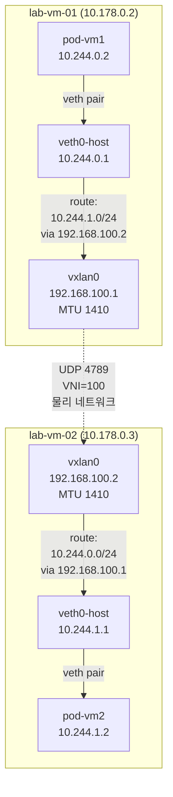
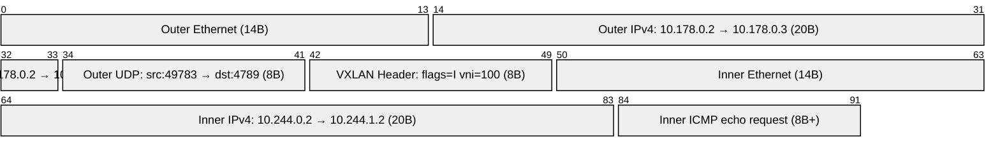

# 04. 터널링 & 오버레이 네트워크

> VM 두 대 간 VXLAN 터널을 직접 구축하고, tcpdump로 캡슐화 구조를 바이트 단위로 관찰한다. 이후 pod 네임스페이스를 추가해 K8s Flannel VXLAN 모드가 어떻게 동작하는지 수동으로 재현한다.

---

## 아키텍처

### VXLAN 캡슐화 구조



### VXLAN 패킷 캡슐화 구조 (tcpdump 실측)



**오버헤드 계산**: 20(IP) + 8(UDP) + 8(VXLAN) + 14(이너 이더넷) = **50바이트**
→ MTU: 1460(GCP ens4) − 50 = **1410** (vxlan0에 자동 설정)

### Flannel VXLAN 모드와의 비교

| 항목 | 이 실습 | 실제 K8s Flannel |
|------|---------|-----------------|
| VTEP(터널 엔드포인트) | vxlan0 (수동) | `flannel.1` (flannel 데몬이 생성) |
| 라우팅 설정 | `ip route add` 수동 | flannel 데몬이 etcd/API 서버 감시 후 자동 갱신 |
| ARP/FDB 학습 | 유니캐스트 (remote 지정) | L2miss/L3miss 이벤트로 동적 학습 |
| pod 서브넷 관리 | 수동 (10.244.x.0/24) | `--pod-cidr` → 노드마다 자동 할당 |

---

## 왜 이 주제를 다루는가

K8s의 pod 간 통신은 CNI 플러그인이 구성한 **오버레이 네트워크**로 이루어진다. Flannel(VXLAN), Calico(VXLAN/BGP), Cilium(eBPF) 모두 공통으로 사용하는 원리가 VXLAN이다.

- **VXLAN**(Virtual eXtensible LAN): L2 이더넷 프레임을 UDP로 캡슐화해 L3 네트워크 위에 가상 L2 세그먼트를 구성. VNI(24비트)로 최대 16M개 가상 네트워크 지원. 기존 VLAN(12비트, 4K개)의 한계를 극복.
- **VTEP**(VXLAN Tunnel Endpoint): VXLAN 캡슐화/해제를 담당하는 인터페이스. 커널 내장 기능(`ip link add type vxlan`).

---

## 핵심 기술

| 기술 | 역할 |
|------|------|
| `ip link add type vxlan id VNI remote IP dstport 4789` | VXLAN 인터페이스(VTEP) 생성 |
| `ip route add SUBNET via VTEP_IP dev vxlan0` | pod 서브넷 → VXLAN 경로 지정 |
| `tcpdump port 4789` | VXLAN UDP 패킷 캡처 |
| `ip netns` | pod 네트워크 격리 시뮬레이션 |
| `net.ipv4.ip_forward=1` | VM이 pod 패킷을 VXLAN으로 포워딩 |

---

## 실습 구성

### 인프라

| VM | 물리 IP | VXLAN IP | pod 서브넷 |
|----|--------|---------|-----------|
| lab-vm-01 | 10.178.0.2 | 192.168.100.1 | 10.244.0.0/24 |
| lab-vm-02 | 10.178.0.3 | 192.168.100.2 | 10.244.1.0/24 |

### 스크립트 실행 순서

```bash
# [두 VM 모두] VXLAN 인터페이스 설정
sudo bash scripts/01-setup-vxlan.sh vm1   # lab-vm-01
sudo bash scripts/01-setup-vxlan.sh vm2   # lab-vm-02

# [VM1] VXLAN 캡슐화 관찰
sudo bash scripts/02-capture-encap.sh

# [두 VM 모두] CNI 시뮬레이션 (pod 네임스페이스 + 라우팅)
sudo bash scripts/03-cni-sim.sh vm1   # lab-vm-01
sudo bash scripts/03-cni-sim.sh vm2   # lab-vm-02

# [VM1] pod 간 ping 테스트
sudo bash scripts/04-pod-ping-test.sh

# [두 VM 모두] 정리
sudo bash scripts/cleanup.sh
```

---

## 실험 결과

실측 환경: GCP e2-standard-2 × 2대, asia-northeast3-a, Ubuntu 22.04 (2026-06-22)

### VXLAN 터널 직접 ping

```
PING 192.168.100.2: 3 packets, 0% loss
rtt min/avg/max = 0.258/0.583/1.230 ms
MTU: 1410 (자동 계산: 1460 - 50 = 1410)
```

### pod 간 ping (10.244.0.2 → 10.244.1.2)

```
PING 10.244.1.2: 3 packets, 0% loss
rtt min/avg/max = 0.314/0.409/0.573 ms
TTL=62 (64 − 2홉: pod→host + host→pod 각 1씩 감소)
```

**tcpdump 캡슐화 원문 (발신 패킷)**:
```
10.178.0.2.49783 > 10.178.0.3.4789: VXLAN, flags [I] (0x08), vni 100
IP (ttl 63) 10.244.0.2 > 10.244.1.2: ICMP echo request
```

### ARP도 VXLAN으로 터널링

```
10.178.0.2 > 10.178.0.3: VXLAN vni 100
ARP, Request who-has 192.168.100.2 tell 192.168.100.1
```

L2 브로드캐스트(ARP)가 UDP 유니캐스트로 캡슐화되어 전달된다. VXLAN이 가상 L2 세그먼트를 제공하는 핵심 메커니즘.

---

## 트러블슈팅 요약

| 증상 | 원인 | 해결 |
|------|------|------|
| `ip netns exec` → "Operation not permitted" | sudo 없이 실행 | `sudo ip netns exec ...` |

상세 로그: [PROGRESS.md](./PROGRESS.md)

---

## 학습 키워드

- VXLAN(Virtual eXtensible LAN): L2 over UDP 터널링, VNI(24bit), RFC 7348
- VTEP(VXLAN Tunnel Endpoint): 캡슐화/해제 담당 인터페이스
- `ip link add type vxlan id VNI remote REMOTE dstport 4789 dev PHY`
- VNI(VXLAN Network Identifier): VLAN의 12bit를 24bit로 확장, 최대 16M 세그먼트
- VXLAN 오버헤드: 50바이트 (IP20 + UDP8 + VXLAN8 + InnerEth14)
- MTU 자동 계산: vxlan0 MTU = 물리 MTU − 50
- K8s Flannel VXLAN 모드: `flannel.1` VTEP, 노드당 pod 서브넷 자동 할당
- `flags [I] (0x08)`: VXLAN "I"(Ingress replication valid) 플래그
- TTL 홉 카운트: pod → host(−1) → VXLAN → host(−1) → pod = 2홉
