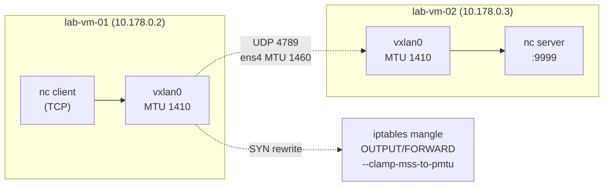
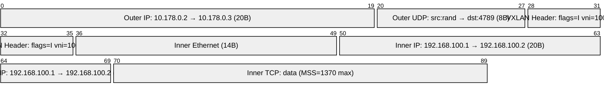

# 05. MTU 트러블슈팅 & 패킷 파편화

> VXLAN 터널링 환경에서 MTU 초과로 발생하는 패킷 드롭을 재현하고, TCP MSS 협상 과정을 관찰한다. 이어서 MSS Clamping으로 문제를 방지하는 과정을 단계별로 시연한다.

---

## 아키텍처

04번(VXLAN) 실습 환경을 그대로 재사용한다.



---

## MTU/MSS 관계 다이어그램



| 레이어 | 크기 | 설명 |
|--------|------|------|
| GCP ens4 MTU | 1460 B | 물리 인터페이스 |
| VXLAN 오버헤드 | 50 B | IP20 + UDP8 + VXLAN8 + InnerEth14 |
| **vxlan0 MTU** | **1410 B** | 커널 자동 계산 |
| ICMP DF 최대 페이로드 | 1382 B | 1410 − 28(ICMP8+IP20) |
| **TCP MSS** | **1370 B** | 1410 − 40(TCP20+IP20) |

---

## 왜 이 주제를 다루는가

VXLAN, VPN, PPPoE처럼 캡슐화 계층이 추가되면 실제 전송 가능한 페이로드 크기가 줄어든다. 이를 인지하지 못하면:

- **ICMP Black Hole**: DF(Don't Fragment) 설정된 패킷이 조용히 드롭, 연결이 응답 없이 멈춤
- **TCP 스톨(stall)**: SYN 단계에서 협상한 MSS가 실제 경로의 MTU보다 커서 대용량 전송 시 패킷 드롭

K8s에서도 CNI(Flannel VXLAN, Calico VXLAN)가 내부 MSS를 자동으로 클램핑하지 않으면 동일한 문제가 발생한다. GKE/EKS는 이를 CNI 설정에서 처리하지만, 직접 구성할 때는 반드시 MSS Clamping을 추가해야 한다.

---

## 핵심 기술

| 기술 | 설명 |
|------|------|
| `ping -M do -s N` | DF 비트 설정 + 페이로드 크기 지정 → MTU 경계 확인 |
| `tcpdump 'tcp[13] & 2 != 0'` | SYN/SYN-ACK 패킷 필터 (TCP 플래그 SYN 비트) |
| `iptables -t mangle ... -j TCPMSS --set-mss N` | SYN 패킷의 MSS 옵션을 N으로 강제 재기록 |
| `--clamp-mss-to-pmtu` | Path MTU에서 자동 계산한 MSS로 클램핑 |
| PMTUD (Path MTU Discovery) | DF 설정 패킷 → 경로 중간 라우터가 ICMP type 3 code 4 반환 |

---

## 실습 구성

### 인프라 (04번 재사용)

| VM | 물리 IP | VXLAN IP | 역할 |
|----|--------|---------|------|
| lab-vm-01 | 10.178.0.2 | 192.168.100.1 | 클라이언트, iptables 적용 |
| lab-vm-02 | 10.178.0.3 | 192.168.100.2 | TCP 서버 |

### 스크립트 실행 순서

```bash
# [두 VM 모두] 04번 VXLAN 환경 복구 (꺼져 있을 경우)
sudo bash ../04-tunneling-overlay-network/scripts/01-setup-vxlan.sh vm1  # lab-vm-01
sudo bash ../04-tunneling-overlay-network/scripts/01-setup-vxlan.sh vm2  # lab-vm-02

# [VM2] TCP 서버 실행
python3 -c "
import socketserver, socket
class H(socketserver.BaseRequestHandler):
    def handle(self):
        d = self.request.recv(65536)
        self.request.sendall(b'OK ' + str(len(d)).encode() + b'\n')
with socketserver.TCPServer(('192.168.100.2', 9999), H) as s:
    s.socket.setsockopt(socket.SOL_SOCKET, socket.SO_REUSEADDR, 1)
    print('서버 시작'); s.serve_forever()
" &

# [VM1] MTU 경계 확인
sudo bash scripts/01-mtu-observe.sh

# [VM1] TCP MSS 관찰
sudo bash scripts/02-tcp-mss.sh

# [VM1] MSS Clamping 데모
sudo bash scripts/03-mss-clamp.sh

# [VM1] 정리
sudo bash scripts/cleanup.sh
```

---

## 실험 결과

실측 환경: GCP e2-standard-2 × 2대, asia-northeast3-a, Ubuntu 22.04 (2026-06-23)

### MTU 경계 (ICMP DF)

```
# ping -c1 -M do -s 1382 192.168.100.2   ← 1382+28=1410, 딱 맞음
1 packets transmitted, 1 received, 0% packet loss

# ping -c1 -M do -s 1383 192.168.100.2   ← 1383+28=1411, 1바이트 초과
ping: local error: message too long, mtu=1410
```

**해석**: DF 설정 시 커널이 단편화 대신 EMSGSIZE 오류를 즉시 반환한다. 실무에서 DF가 설정된 TCP SYN 패킷이 중간 경로에서 조용히 드롭되면 연결 타임아웃만 발생해 원인 파악이 어렵다.

### TCP MSS 협상 (tcpdump 실측)

```
# SYN
IP 192.168.100.1 > 192.168.100.2: Flags [S],
  options [mss 1370, ...]

# SYN-ACK
IP 192.168.100.2 > 192.168.100.1: Flags [S.],
  options [mss 1370, ...]
```

양쪽 모두 vxlan0(MTU 1410)을 경유하므로 `1410 − 40 = 1370` MSS를 자동 계산·협상한다.

### MSS Clamping 효과 비교

| 단계 | SYN MSS | SYN-ACK MSS | 실제 MSS |
|------|---------|------------|---------|
| 기본 | 1370 | 1370 | **1370** |
| `--set-mss 500` | **500** | 1370 | **500** |
| `--clamp-mss-to-pmtu` | 1370 | 1370 | **1370** |

`--set-mss 500` 적용 시 SYN 패킷의 MSS 필드가 500으로 재기록되고, 서버는 그보다 큰 1370을 제안하더라도 `min(500, 1370) = 500`이 실제 MSS로 결정된다. 데이터는 전송되지만 세그먼트당 최대 500바이트로 제한되어 대용량 전송 시 성능이 극단적으로 저하된다.

`--clamp-mss-to-pmtu`는 Path MTU(여기서는 1410)에서 40을 뺀 1370을 자동으로 계산해 클램핑하므로, 수동 값 계산 없이 터널 MTU가 바뀌어도 항상 올바른 MSS를 유지한다.

### GCP 환경 제약

```
# sudo ip link set vxlan0 mtu 1500
RTNETLINK answers: Invalid argument
```

GCP 커널 패치로 vxlan0 MTU를 물리 MTU(1460) − VXLAN 오버헤드(50) = 1410 이상으로 올릴 수 없다. MTU Black Hole(패킷은 전달되지만 ICMP unreachable이 차단되어 연결이 멈추는 현상)을 직접 재현하는 대신, 커널이 정상 동작하는 케이스(EMSGSIZE 즉시 반환)와 MSS Clamping을 중심으로 실습을 구성했다.

---

## 트러블슈팅 요약

| 증상 | 원인 | 해결 |
|------|------|------|
| `ip link set vxlan0 mtu 1500` → "RTNETLINK answers: Invalid argument" | GCP 커널이 vxlan0 MTU를 물리 MTU−오버헤드 이상으로 올리는 것을 막음 | MTU Black Hole 직접 재현 불가 → MSS Clamping 실습으로 전환 |
| MSS Clamping이 nc 연결에서 적용 안 됨 | nc는 로컬에서 패킷을 생성하므로 FORWARD가 아닌 OUTPUT 체인에 규칙 필요 | OUTPUT 체인에 `--set-mss` 추가 |

상세 로그: [PROGRESS.md](./PROGRESS.md)

---

## 학습 키워드

- MTU(Maximum Transmission Unit): 인터페이스가 한 번에 전송 가능한 최대 프레임 크기
- MSS(Maximum Segment Size): TCP 세그먼트 데이터 부분 최대 크기 = MTU − IP헤더(20) − TCP헤더(20)
- DF(Don't Fragment) 비트: IP 헤더의 단편화 금지 플래그. ICMP Black Hole과 PMTUD의 핵심
- PMTUD(Path MTU Discovery): DF 패킷 → 라우터가 ICMP type3 code4 반환 → 송신자가 MTU 조정
- MSS Clamping: SYN/SYN-ACK 패킷의 MSS 옵션을 iptables mangle로 재기록, 터널 MTU에 맞게 조정
- `--clamp-mss-to-pmtu`: Path MTU 기반 자동 계산 (터널 MTU 변경에도 적응)
- `--set-mss N`: 고정값으로 MSS 강제. 정밀 제어가 필요할 때 사용
- FORWARD vs OUTPUT 체인: 라우팅 패킷 → FORWARD, 로컬 생성 패킷 → OUTPUT
- `tcp[13] & 2 != 0`: tcpdump BPF 표현식으로 SYN 비트가 설정된 패킷만 캡처
