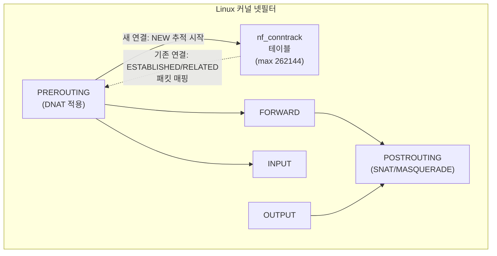
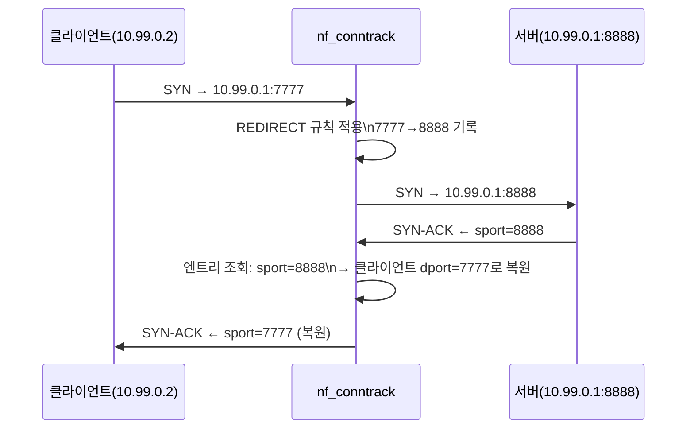

# 06. Conntrack & NAT 테이블 한계

> `nf_conntrack` 테이블 구조를 직접 관찰하고, NAT가 conntrack에 의존하는 방식을 확인한다. 이어서 테이블을 의도적으로 고갈시켜 신규 연결이 조용히 드롭되는 실무 장애를 재현하고, sysctl 튜닝으로 해결한다.

---

## 아키텍처



---

## conntrack 엔트리 구조

```
tcp  6  431991  ESTABLISHED
  src=10.178.0.2  dst=169.254.169.254  sport=46536  dport=80
  src=169.254.169.254  dst=10.178.0.2  sport=80  dport=46536
  [ASSURED] mark=0 use=1
  ①   ②       ③          ④상태
  ⑤원본방향(송신)          ⑥응답방향(수신)
```

| 필드 | 설명 |
|------|------|
| TTL(초) | 마지막 패킷 이후 엔트리 만료까지 남은 시간 |
| ASSURED | 양방향 패킷이 모두 확인됨 (FIN/RST 전까지 유지) |
| 원본방향 | 클라이언트 → 서버 방향 5-tuple |
| 응답방향 | NAT 없으면 대칭, NAT 있으면 변환된 주소/포트 기록 |

---

## NAT와 conntrack의 관계



conntrack 엔트리:
```
Original: src=10.99.0.2  dst=10.99.0.1  dport=7777
Reply:    src=10.99.0.1  dst=10.99.0.2  sport=8888  ← 포트 변환 기록
```

응답 패킷의 `sport=8888`을 보고 conntrack이 `sport=7777`로 복원해 클라이언트에 전달한다. **이 매핑이 없으면 NAT 응답 패킷을 어디로 보내야 할지 알 수 없다.** NAT가 stateful한 이유가 바로 conntrack 의존성 때문이다.

---

## 왜 이 주제를 다루는가

K8s에서 `kube-proxy`(iptables 모드)는 ClusterIP → Pod IP로의 DNAT를 구현할 때 conntrack을 활용한다. Service 수가 많아지거나 대규모 클러스터에서 Pod가 빈번하게 재시작되면:

1. **conntrack 테이블이 가득 참** → 신규 연결이 RST 없이 **조용히 드롭**
2. 클라이언트 입장에서는 connection timeout만 보임 → 원인 파악이 매우 어려움
3. `dmesg`에 `nf_conntrack: table full, dropping packet` 로그가 남음

GKE, EKS 등 managed K8s에서도 이 문제는 실제로 발생하며, 노드별 sysctl 튜닝이 필수다.

---

## 핵심 기술

| 명령/파라미터 | 설명 |
|-------------|------|
| `conntrack -L` | 테이블 전체 출력 |
| `conntrack -C` | 현재 엔트리 수 카운트 |
| `/proc/sys/net/netfilter/nf_conntrack_count` | 실시간 카운트 |
| `nf_conntrack_max` | 추적 가능한 최대 연결 수 |
| `nf_conntrack_buckets` | 해시 테이블 버킷 수 (조회 성능) |
| `nf_conntrack_tcp_timeout_established` | ESTABLISHED 엔트리 유지 시간 |
| `nf_conntrack_tcp_timeout_time_wait` | TIME_WAIT 엔트리 유지 시간 |

---

## 실습 구성

### 인프라

lab-vm-01 단독 (network namespace로 분리된 클라이언트 시뮬레이션)

### 스크립트 실행 순서

```bash
# conntrack 상태 관찰
sudo bash scripts/01-conntrack-observe.sh

# NAT 추적 데모 (REDIRECT 7777→8888)
sudo bash scripts/02-nat-tracking.sh

# 테이블 고갈 재현 (max=64으로 축소 후 100개 연결 시도)
sudo bash scripts/03-table-full.sh

# sysctl 튜닝 적용
sudo bash scripts/04-sysctl-tune.sh

# 정리 (sysctl 기본값 복원 + iptables/netns 제거)
sudo bash scripts/cleanup.sh
```

---

## 실험 결과

실측 환경: GCP e2-standard-2, asia-northeast3-a, Ubuntu 22.04 / kernel 6.8.0-1060-gcp (2026-06-23)

### 초기 상태

```
nf_conntrack_max     = 262144
nf_conntrack_buckets = 262144
nf_conntrack_count   = 21
```

엔트리 구성:
- SSH ESTABLISHED × 2 (dport=22)
- GCP 메타데이터 서버 ESTABLISHED × 2 (dst=169.254.169.254:80)
- 외부 ICMP 스캐너 × 다수 (type=8, TTL 카운트다운 중)
- DNS UDP × 2 (dst=8.8.8.8:53)

### NAT 추적 (REDIRECT 7777→8888)

```
Original: src=10.99.0.2  dst=10.99.0.1  dport=7777
Reply:    src=10.99.0.1  dst=10.99.0.2  sport=8888  ← 포트 변환 기록
```

응답 방향의 `sport=8888`이 DNAT 변환 정보를 담고 있다.

### 테이블 고갈 재현

```
nf_conntrack_max = 64 (임시 축소)
100개 연결 시도 → 59개 성공, 41개 실패 (timed out)

dmesg:
[169641.621542] nf_conntrack: nf_conntrack: table full, dropping packet
[169642.645176] nf_conntrack: nf_conntrack: table full, dropping packet
[169643.668957] nf_conntrack: nf_conntrack: table full, dropping packet
```

**실패 모드가 `timed out`(silent drop)** 인 점이 핵심이다. `connection refused`(RST)와 달리 클라이언트는 서버가 살아있는지 죽었는지 알 수 없고, 커넥션 풀이 timeout까지 hang 상태로 남는다.

36~49번이 실패 후 50~61번이 다시 성공한 이유: HTTP server가 요청 처리 후 연결을 닫아 TIME_WAIT 엔트리가 만료되며 빈 슬롯이 생겼기 때문이다.

### sysctl 튜닝 결과

| 파라미터 | 기본값 | 실무 권장 | 효과 |
|---------|--------|---------|------|
| `nf_conntrack_max` | 262144 | 524288+ | 수용 가능 연결 수 증가 |
| `timeout_established` | 432000 (5일) | 1800 (30분) | 좀비 연결 조기 만료 |
| `timeout_time_wait` | 120 (2분) | 30 | TIME_WAIT 슬롯 빠른 재활용 |

**기본값 `timeout_established=432000`(5일)은 좀비 연결 양산의 주범**: 앱이 FIN/RST 없이 종료하면 연결 엔트리가 5일간 테이블을 점유한다.

---

## 트러블슈팅 요약

| 증상 | 원인 | 해결 |
|------|------|------|
| 신규 연결 timeout (RST 없음) | nf_conntrack 테이블 만료 | nf_conntrack_max 증가 또는 timeout 단축 |
| `dmesg`에 "table full" | 위와 동일 | 위와 동일 |
| NAT 응답이 클라이언트에 도달 안 됨 | conntrack 엔트리 만료 또는 비대칭 라우팅 | timeout 확인, 라우팅 경로 대칭 보장 |

상세 로그: [PROGRESS.md](./PROGRESS.md)

---

## 학습 키워드

- `nf_conntrack`: Linux 커널의 connection tracking 서브시스템, NAT/stateful 방화벽의 기반
- 5-tuple: src IP, dst IP, src port, dst port, protocol → 연결 식별자
- `ESTABLISHED` / `TIME_WAIT` / `NEW` / `RELATED`: conntrack TCP 상태 머신
- `ASSURED` 플래그: 양방향 패킷 확인 완료. FIN/RST 전까지 TTL 리셋 계속됨
- `nf_conntrack_max`: 테이블 한계. 초과 시 SYN을 **조용히 드롭** (RST 아님)
- `nf_conntrack_buckets`: 해시 테이블 크기. max/4 ~ max 권장 (클수록 조회 O(1) 보장)
- `timeout_established=432000`: 기본 5일. 좀비 연결 발생 시 테이블 점유 주범
- `dmesg | grep conntrack`: 테이블 full 이벤트 확인
- K8s kube-proxy(iptables 모드): ClusterIP DNAT가 conntrack 의존. Pod 재시작 빈번 시 stale 엔트리 누적
