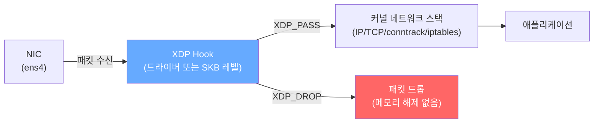

# 07. eBPF 기반 네트워크 분석

> XDP(eXpress Data Path) 프로그램을 직접 C로 작성하고 컴파일해 NIC에 로드한다. 프로토콜별 패킷 카운터로 BPF 맵의 동작을 확인하고, ICMP 드롭 프로그램으로 커널 스택 진입 전 패킷 차단(DDoS 방어 원리)을 실증한다.

---

## 아키텍처

### XDP 패킷 처리 경로



### XDP 3가지 모드

| 모드 | 진입점 | 속도 | 조건 |
|------|--------|------|------|
| **Native** | NIC 드라이버 (RX ring) | 가장 빠름 | 드라이버 XDP 지원 필요 |
| **Generic (SKB)** | SKB 할당 후 | iptables보다 빠름 | 모든 드라이버 동작 |
| **Offloaded** | NIC 하드웨어 | 최고 속도 | 특수 NIC(Netronome 등) |

GCP virtio-net은 native XDP 미지원 → 이 실습에서는 `xdpgeneric` 사용

### BPF 맵 구조 (pkt_counter)

```
BPF_MAP_TYPE_ARRAY
  key:   __u32  (IP 프로토콜 번호, 0-255)
  value: __u64  (수신 패킷 카운트)
  max_entries: 256

proto_count[1]  = ICMP 수신 패킷 수
proto_count[6]  = TCP  수신 패킷 수
proto_count[17] = UDP  수신 패킷 수
```

---

## 왜 이 주제를 다루는가

iptables는 각 패킷마다 규칙 체인을 순회하고 SKB를 할당한다. 규칙 수가 많을수록 O(N) 비용이 증가해 대규모 K8s 클러스터에서 병목이 된다. **eBPF/XDP**는 이 한계를 극복한다.

- **XDP_DROP**: SKB 할당 없이 드라이버 레벨에서 즉시 드롭 → DDoS 방어에 최적
- **BPF 맵**: 커널-유저스페이스 간 zero-copy 데이터 공유 → 실시간 모니터링
- **Cilium**: XDP/eBPF로 kube-proxy를 완전 대체, ClusterIP DNAT를 BPF로 처리

---

## 핵심 기술

| 기술 | 설명 |
|------|------|
| `clang -O2 -g -target bpf` | C 코드를 BPF 바이트코드(.o)로 컴파일. `-g`로 BTF 정보 포함 |
| `ip link set dev IF xdpgeneric obj PROG.o sec xdp` | XDP 프로그램 로드 (generic 모드) |
| `ip link set dev IF xdpgeneric off` | XDP 프로그램 언로드 |
| `bpftool prog show` | 로드된 BPF 프로그램 목록 |
| `bpftool map show` / `map lookup` | BPF 맵 조회 |
| `SEC("xdp")` | XDP 훅 포인트 지정 섹션 |
| `XDP_PASS` / `XDP_DROP` | 패킷 통과 / 드롭 verdict |
| `BPF_MAP_TYPE_ARRAY` | 고정 크기 배열 맵. 인덱스 기반 O(1) 조회 |
| `__sync_fetch_and_add` | BPF 내 atomic 카운터 증가 |
| BTF (BPF Type Format) | BPF 프로그램의 타입 정보. 커널 6.x에서 로드 필수 |

---

## 실습 구성

### 인프라

lab-vm-01 단독 (kernel 6.8.0-1060-gcp, Ubuntu 22.04)

### 사전 설치

```bash
sudo apt install -y clang llvm libbpf-dev libelf-dev
```

### 스크립트 실행 순서

```bash
# XDP 프로그램 컴파일
sudo bash scripts/01-build.sh

# [실험 1] 프로토콜별 패킷 카운터 로드 및 관찰
sudo bash scripts/02-xdp-counter.sh

# [실험 2] ICMP 드롭 프로그램으로 DDoS 방어 시연
sudo bash scripts/03-xdp-drop-icmp.sh

# 정리
sudo bash scripts/cleanup.sh
```

---

## 실험 결과

실측 환경: GCP e2-standard-2, asia-northeast3-a, Ubuntu 22.04 / kernel 6.8.0-1060-gcp (2026-06-24)

### 패킷 카운터 (pkt_counter.c)

트래픽 발생 전후 BPF 맵 값 비교 (`ping -c3 8.8.8.8` + `dig google.com` + `curl example.com`):

| 프로토콜 | 전 | 후 | 증가분 | 원인 |
|---------|----|----|--------|------|
| ICMP (1) | 0 | 3 | +3 | ping echo reply 3개 수신 |
| TCP (6) | 127 | 152 | +25 | HTTP 응답 패킷 |
| UDP (17) | 2 | 5 | +3 | DNS 응답 패킷 |

XDP는 **ingress(수신)** 경로에만 붙으므로 송신 패킷(echo request, DNS query, HTTP request)은 카운트되지 않는다.

### ICMP 드롭 (drop_icmp.c)

```
# XDP 로드 후 ping 테스트
ping -c3 -W1 8.8.8.8
3 packets transmitted, 0 received, 100% packet loss   ← XDP_DROP

# TCP는 정상
curl -s http://example.com → 200 OK                    ← XDP_PASS

# XDP 언로드 후
ping -c3 8.8.8.8
3 packets transmitted, 3 received, 0% packet loss      ← 복구
rtt min/avg/max = 0.650/0.740/0.892 ms
```

### iptables DROP vs XDP DROP 비교

| 구분 | iptables DROP | XDP DROP |
|------|--------------|---------|
| 처리 시점 | SKB 할당 후, 체인 순회 후 | 드라이버 레벨 (SKB 할당 없음) |
| 규칙 수 의존성 | O(N) | O(1) |
| CPU 사용 | 높음 (DDoS 시 포화) | 낮음 |
| 적용 예시 | 일반 방화벽 | DDoS 완화, Cloudflare, Cilium |

---

## 트러블슈팅 요약

| 증상 | 원인 | 해결 |
|------|------|------|
| `libbpf: BTF is required` | `-g` 없이 컴파일 → BTF 정보 미포함 | `clang -O2 -g -target bpf` |
| `virtio_net: XDP expects header/data in single page` | GCP virtio-net이 native XDP 미지원 | `xdpgeneric` (generic/SKB 모드) 사용 |

상세 로그: [PROGRESS.md](./PROGRESS.md)

---

## 학습 키워드

- eBPF(extended Berkeley Packet Filter): 커널 수정 없이 커널 내에서 안전하게 실행되는 샌드박스 프로그램
- XDP(eXpress Data Path): eBPF 실행 포인트 중 가장 빠름. 드라이버 직후 처리
- BPF verifier: 커널 로드 시 safety check. 무한 루프, OOB 접근 거부
- JIT 컴파일: BPF 바이트코드 → 네이티브 머신 코드 (런타임 성능)
- BTF(BPF Type Format): BPF 프로그램의 타입 정보. 최신 커널에서 로드 필수, `-g` 플래그로 생성
- `SEC("xdp")`: 프로그램 유형과 훅 포인트 지정 (libbpf가 이 이름으로 로드)
- `XDP_PASS / XDP_DROP / XDP_TX / XDP_REDIRECT`: XDP verdict
- `BPF_MAP_TYPE_ARRAY`: 고정 크기 배열. 인덱스(0-N)로 O(1) 접근
- `bpftool map lookup id ID key HEX`: BPF 맵 값 직접 조회
- Cilium: eBPF/XDP로 kube-proxy 대체, BPF 맵으로 ClusterIP DNAT 처리
- Cloudflare: XDP로 ~10Mpps DDoS 트래픽을 단일 코어로 처리한 사례
