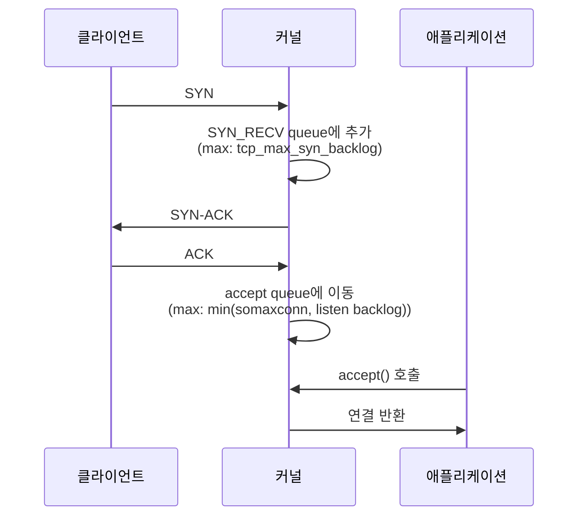
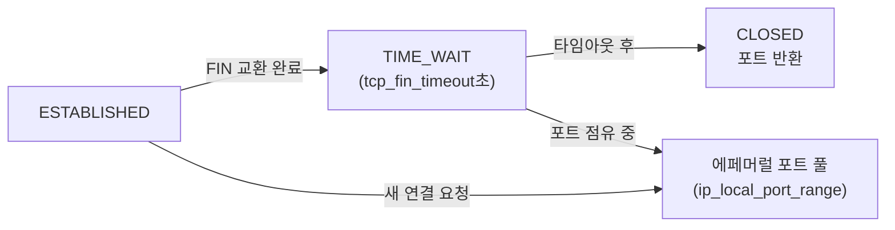

# 08. TCP 커널 파라미터 튜닝

> `somaxconn` 부족으로 accept queue가 넘치는 장애와 TIME_WAIT 소켓 누적으로 에페머럴 포트가 고갈되는 장애를 직접 재현한다. 이어서 핵심 TCP sysctl을 튜닝해 수용 가능한 동시 연결 수를 극적으로 늘리는 과정을 실증한다.

---

## 아키텍처

### TCP 연결 수립 큐 구조



**accept queue가 가득 찬 경우**: ACK를 조용히 드롭 → 클라이언트 timeout (RST 없음)

### TIME_WAIT와 에페머럴 포트



---

## 왜 이 주제를 다루는가

K8s 환경에서 Pod는 초당 수백~수천 건의 서비스 간 연결을 맺고 끊는다. 이 과정에서 두 가지 병목이 자주 발생한다.

1. **somaxconn 부족**: 트래픽 급증 시 accept queue 포화 → 연결 드롭. `dmesg` 없이는 원인 파악이 어렵고 클라이언트에는 timeout만 보임.
2. **TIME_WAIT 포트 고갈**: 단기 연결이 많은 서비스에서 `ip_local_port_range`의 포트가 TIME_WAIT 소켓으로 모두 묶임 → 새 연결 실패 (`EADDRNOTAVAIL`).

두 문제 모두 **sysctl 튜닝**으로 예방 가능하다.

---

## 핵심 기술

| 파라미터 | 기본값 | 설명 |
|---------|--------|------|
| `net.core.somaxconn` | 4096 | accept queue 최대 크기. `listen(backlog)`와 `min()` 취함 |
| `net.ipv4.tcp_max_syn_backlog` | 512 | SYN_RECV(half-open) queue 크기 |
| `net.ipv4.tcp_tw_reuse` | 2 | TIME_WAIT 포트 재사용. 1=전체, 2=루프백만 |
| `net.ipv4.tcp_fin_timeout` | 60 | TIME_WAIT 상태 유지 시간(초) |
| `net.ipv4.ip_local_port_range` | 32768-60999 | 아웃바운드 연결용 에페머럴 포트 범위 |

| 명령 | 설명 |
|------|------|
| `ss -lnt` | 리스닝 소켓의 Recv-Q(대기), Send-Q(max backlog) 확인 |
| `nstat -az \| grep ListenOverflow` | accept queue 오버플로 누적 카운터 |
| `ss -ant \| grep TIME-WAIT \| wc -l` | TIME_WAIT 소켓 수 확인 |

---

## 실습 구성

### 인프라

lab-vm-01 단독

### 스크립트 실행 순서

```bash
# 기본값 확인
sudo bash scripts/01-observe-baseline.sh

# somaxconn 오버플로 재현
sudo bash scripts/02-somaxconn-overflow.sh

# TIME_WAIT 누적 + 포트 고갈 재현
sudo bash scripts/03-timewait-exhaustion.sh

# sysctl 튜닝 적용
sudo bash scripts/04-sysctl-tune.sh

# 기본값 복원
sudo bash scripts/cleanup.sh
```

---

## 실험 결과

실측 환경: GCP e2-standard-2, asia-northeast3-a, Ubuntu 22.04 / kernel 6.8.0-1060-gcp (2026-06-24)

### 초기 상태

```
somaxconn              = 4096
tcp_max_syn_backlog    = 512
tcp_tw_reuse           = 2  (루프백만)
tcp_fin_timeout        = 60
ip_local_port_range    = 32768-60999  (~28K 포트)
```

### somaxconn 오버플로

```
somaxconn = 5, listen(backlog=3) 서버에 50개 동시 연결:

TcpExtListenOverflows: 11428 → 11474  (+46 드롭)

ss -lnt:
LISTEN  Recv-Q=4  Send-Q=3  127.0.0.1:9999
        ↑ 대기 중   ↑ 최대 backlog
```

`Recv-Q(4) ≥ Send-Q(3)`: accept queue가 포화 상태. 이후 도착한 46개 연결의 ACK가 조용히 드롭됐다. 클라이언트는 RST 없이 timeout만 받는다.

### TIME_WAIT 누적

```
50개 curl http://example.com 실행 후:
TIME_WAIT 소켓 다수 누적

TIME-WAIT  10.178.0.2:34500  172.66.147.243:80
TIME-WAIT  10.178.0.2:40328  172.66.147.243:80
...
```

### 포트 고갈

```
ip_local_port_range = 10000-10099  (포트 100개)
150개 연결 시도:
성공: 0, 실패: 150  ← EADDRNOTAVAIL

실무 계산:
초당 500개 연결 × tcp_fin_timeout 60초 = 30,000 TIME_WAIT
기본 포트 범위(28K) < 30,000 → 고갈
```

### 권장 튜닝값

| 파라미터 | 기본값 | 권장값 | 효과 |
|---------|--------|--------|------|
| `somaxconn` | 4096 | 65535 | accept queue 한계 제거 |
| `tcp_max_syn_backlog` | 512 | 8192 | SYN Flood + 대량 연결 내성 |
| `tcp_tw_reuse` | 2 | 1 | TIME_WAIT 포트 즉시 재사용 |
| `tcp_fin_timeout` | 60 | 30 | TIME_WAIT 회전 2배 빠름 |
| `ip_local_port_range` | 32768-60999 | 1024-65535 | 포트 풀 ~64K로 확대 |

---

## 트러블슈팅 요약

| 증상 | 원인 | 진단 | 해결 |
|------|------|------|------|
| 연결 timeout (RST 없음) | accept queue 오버플로 | `nstat ListenOverflows` 증가 | `somaxconn` 증가 |
| 연결 실패 `EADDRNOTAVAIL` | 에페머럴 포트 고갈 | `ss -ant \| grep TIME-WAIT \| wc -l` | `ip_local_port_range` 확장, `tcp_tw_reuse=1` |

상세 로그: [PROGRESS.md](./PROGRESS.md)

---

## 학습 키워드

- accept queue: 3-way handshake 완료 후 `accept()` 대기 중인 연결 큐
- `somaxconn`: accept queue 상한. 서버 기동 시 `listen(backlog)`와 `min()` 취함
- `SYN_RECV queue`: half-open 연결 추적. `tcp_max_syn_backlog`로 크기 제한
- `TcpExtListenOverflows`: accept queue 오버플로 누적 카운터 (`nstat -az`)
- `ss -lnt`: Recv-Q(대기 연결 수), Send-Q(최대 backlog) 실시간 확인
- TIME_WAIT: FIN 교환 완료 후 `tcp_fin_timeout`초 동안 유지. 동일 4-tuple 재사용 방지
- `EADDRNOTAVAIL`: 에페머럴 포트 고갈. `ip_local_port_range` 확장 또는 `tcp_tw_reuse=1`
- `tcp_tw_reuse=1`: TIME_WAIT 상태의 소켓 포트를 동일 목적지로의 새 연결에 재사용
- K8s: Pod 간 mTLS(sidecar) 환경에서 단기 연결 폭증 → TIME_WAIT 고갈 실사례
