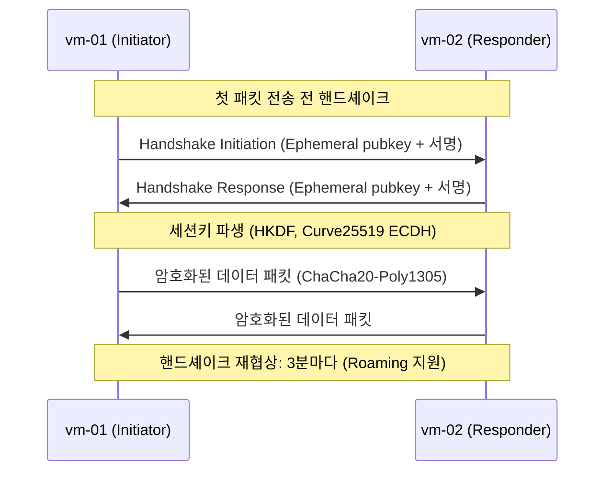

# 09. Ad-hoc & 메시 네트워크 — WireGuard Full Mesh

## 왜 이 주제인가

K8s 클러스터, 멀티 리전 서비스, 원격 개발환경 등 현대 인프라는 물리적으로 분산된 노드들을 안전하게 연결해야 한다. WireGuard는 IPsec 대비 코드베이스가 4000줄 수준으로 작고 커널에 내장(Linux 5.6+)되어 운영 복잡도가 낮다. 이번 실습은 3-노드 Full Mesh를 직접 구성하고 노드 장애 시 감지 시간(Convergence Time)을 측정한다.

---

## 아키텍처

### Full Mesh 토폴로지

```
         WireGuard Mesh (10.0.0.0/24)
         물리 네트워크: 10.178.0.0/24

  [lab-vm-01]           [lab-vm-02]
  WG: 10.0.0.1    ←――→  WG: 10.0.0.2
  Phy: 10.178.0.2        Phy: 10.178.0.3
       ↑ ↑                    ↑
       |  ╲                   |
       |   ╲                  |
       |    ╲                 |
  [lab-vm-03]
  WG: 10.0.0.3
  Phy: 10.178.0.4
```

- 노드 수 N=3 → 엣지 수 N*(N-1)/2 = **3개** 독립 터널
- 각 노드는 다른 2개 노드와 직접 암호화 터널을 유지
- 특정 노드 장애 시 나머지 노드 간 통신은 **영향 없음**

### WireGuard 패킷 구조

```
┌───────────────────────────────────────────────┐
│ UDP/IP (물리 네트워크, 10.178.0.x, port 51820)  │
│ ┌─────────────────────────────────────────────┐│
│ │ WireGuard Header (Type + Receiver Index)   ││
│ │ ┌───────────────────────────────────────────┤│
│ │ │ ChaCha20-Poly1305 암호화 페이로드         ││
│ │ │ ┌─────────────────────────────────────────┤│
│ │ │ │ Inner IP Packet (10.0.0.x → 10.0.0.y)  ││
│ │ │ └─────────────────────────────────────────┤│
│ │ └───────────────────────────────────────────┤│
│ └─────────────────────────────────────────────┘│
└───────────────────────────────────────────────┘
```

### Handshake 흐름 (처음 트래픽 발생 시)



---

## 실습 환경

| VM | WireGuard IP | 물리 IP | 역할 |
|----|-------------|---------|------|
| lab-vm-01 | 10.0.0.1 | 10.178.0.2 | Mesh 노드 1 |
| lab-vm-02 | 10.0.0.2 | 10.178.0.3 | Mesh 노드 2 (장애 시뮬레이션 대상) |
| lab-vm-03 | 10.0.0.3 | 10.178.0.4 | Mesh 노드 3 |

---

## 실습 결과

### 1. Full Mesh 연결 검증

모든 엣지에서 0% 패킷 손실, 암호화 터널 RTT ~0.8~1.2ms (동일 리전 GCP VM):

```
vm-01 → vm-02: 0% loss, avg 1.09ms  (latest handshake: 4s ago)
vm-01 → vm-03: 0% loss, avg 1.15ms  (latest handshake: 2s ago)
vm-02 → vm-01: 0% loss, avg 0.83ms
vm-02 → vm-03: 0% loss, avg 1.13ms
```

WireGuard MTU: 1380 (GCP 물리 MTU 1460 - WireGuard 헤더 80바이트)

### 2. 장애 감지 시간 (Convergence Time) 측정

vm-01에서 1초 간격 ping 모니터링 중 vm-02의 `wg-quick down wg0` 실행:

```
[ 10s] vm-02: ✅  vm-03: ✅   ← 장애 직전
[ 12s] vm-02: ❌  vm-03: ✅   ← 장애 감지 (약 2초)
...
[ 41s] vm-02: ❌  vm-03: ✅   ← vm-02 down 상태
[ 43s] vm-02: ✅  vm-03: ✅   ← 복구 감지 (약 2초)
```

**결론:**
- **장애 감지 시간**: ~2초 (ping timeout 1초 + loop sleep 1초)
- **복구 감지 시간**: ~2초 (`wg-quick up` 후 즉시 핸드셰이크)
- **vm-03 독립성**: vm-02 장애 기간 내내 vm-03 터널 영향 없음

> WireGuard는 keepalive 없이 "on-demand" 핸드셰이크 방식 — 트래픽이 없으면 장애를 감지하지 못한다. 실무에서는 `PersistentKeepalive = 25`를 설정해 25초 간격으로 probe를 보내 NAT 홀 펀칭 유지 + 장애 감지를 동시에 해결한다.

---

## 핵심 개념

### WireGuard vs IPsec/OpenVPN

| 항목 | WireGuard | IPsec/StrongSwan | OpenVPN |
|------|-----------|-----------------|---------|
| 커널 통합 | ✅ Linux 5.6+ 내장 | ✅ 커널 내장 | ❌ 유저스페이스 |
| 코드 크기 | ~4,000줄 | 수십만 줄 | 수만 줄 |
| 암호화 | ChaCha20-Poly1305, Curve25519 | AES-GCM, RSA/ECDSA (설정 복잡) | OpenSSL 전체 |
| 설정 복잡도 | 낮음 (pubkey 교환만) | 높음 (IKE/PSK/인증서) | 중간 |
| PKI 필요 | ❌ (pubkey 직접 교환) | 옵션 | ✅ |

### Full Mesh vs Hub-and-Spoke

```
Full Mesh (이번 실습)        Hub-and-Spoke
  A ─── B                    A
  │ ╲ ╱ │                    │
  │  ×  │          A ─── Hub ─── B
  │ ╱ ╲ │                    │
  C ─── D                    C

장점: 단일 경로 장애에 강함    장점: 설정 단순, peer 수 적음
단점: N*(N-1)/2 peer 설정    단점: Hub 장애 시 전체 단절
```

N=3: Full Mesh 3개 peer 쌍 vs Hub-and-Spoke 2개 (Hub 제외)
N=10: Full Mesh 45개 vs Hub-and-Spoke 9개 → 대규모에서는 Hub-and-Spoke 또는 Babel/OSPF 등 동적 라우팅 필요

---

## 스크립트 목록

| 파일 | 설명 | 실행 노드 |
|------|------|---------|
| `01-install-wireguard.sh` | WireGuard 설치 + 키 쌍 생성 | 전체 |
| `02-setup-vm01.sh` | lab-vm-01 wg0.conf 생성 + 시작 | vm-01 |
| `03-setup-vm02.sh` | lab-vm-02 wg0.conf 생성 + 시작 | vm-02 |
| `04-setup-vm03.sh` | lab-vm-03 wg0.conf 생성 + 시작 | vm-03 |
| `05-verify-mesh.sh` | Full Mesh 연결 ping 검증 | 전체 |
| `06-failover-test.sh` | 노드 장애 감지 시간 측정 | vm-01 (모니터), vm-02 (대상) |
| `07-cleanup.sh` | wg0 종료 + 정리 | 전체 |

---

## 참고

- [WireGuard Whitepaper](https://www.wireguard.com/papers/wireguard.pdf)
- `man wg`, `man wg-quick`
- WireGuard 커널 소스: `drivers/net/wireguard/` (Linux 5.6+)
