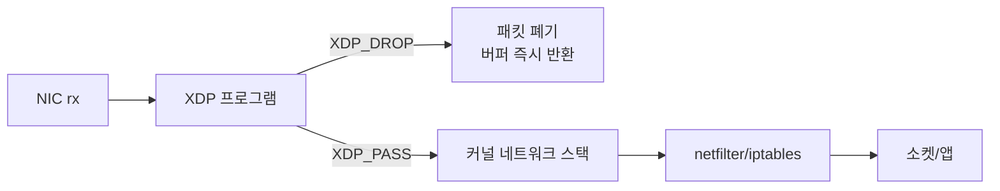

# 11. XDP 기반 DDoS 방어 시뮬레이션

## 왜 이 주제인가

토스·당근·카카오 같은 대형 플랫폼은 초당 수백만 패킷의 DDoS 공격을 받는다. 전통적인 iptables 방어는 Linux netfilter 스택을 모두 통과한 뒤 패킷을 드롭하기 때문에, 공격 트래픽이 많아질수록 CPU 소모가 선형으로 증가한다. XDP(eXpress Data Path)는 NIC 드라이버 레벨에서 패킷을 드롭해 이 오버헤드를 원천 차단한다. 07번에서 구현한 XDP를 실제 DDoS 방어 시나리오에 적용하고, iptables와 CPU 사용률·드롭 레이트를 수치로 비교한다.

---

## 아키텍처

```
[lab-vm-01] 공격자                [lab-vm-02] 방어 대상
10.178.0.2                        10.178.0.3

hping3 --flood -1 ──────────────→ NIC (ens4)
                                      │
                        ┌─────────────┤
                        │             │
                   [XDP hook]    [드라이버 rx]
                    xdp_drop.c        │
                        │        [SKB 생성]
                   XDP_DROP           │
                    (early)      [netfilter]
                                 iptables -j DROP
                                    (late)
```

### 패킷 드롭 시점 비교

```
NIC rx
  │
  ▼
[XDP hook] ◄── XDP DROP: 여기서 차단 (SKB 생성 전 or 직후)
  │
  ▼
SKB 할당 (메모리 할당 비용 발생)
  │
  ▼
netfilter INPUT chain
  │
  ▼
[iptables DROP] ◄── iptables DROP: 여기서 차단 (훨씬 늦음)
  │
  ▼
socket / 응용 프로그램
```

> GCP virtio-net은 native XDP를 지원하지 않아 **xdpgeneric**(SKB 생성 후 처리)을 사용한다. 프로덕션 환경(Intel i40e, Mellanox mlx5 등)에서는 XDP가 SKB 생성 전에 동작해 차이가 더 극적이다.

---

## 실습 환경

| VM | 물리 IP | 역할 |
|----|---------|------|
| lab-vm-01 | 10.178.0.2 | 공격자 (hping3 flood) |
| lab-vm-02 | 10.178.0.3 | 방어 대상 (iptables / XDP 교체 측정) |

---

## 실험 방법

세 가지 조건에서 동일한 ICMP flood(hping3 --flood)를 받아 CPU를 비교한다.

| 조건 | 방어 방법 | 드롭 시점 |
|------|---------|---------|
| Baseline | 없음 | 드롭 안 함 (ICMP 응답) |
| iptables | `iptables -A INPUT -s 10.178.0.2 -j DROP` | netfilter 훅 (late) |
| XDP | `xdp_ddos_filter` + blocklist BPF 맵 | NIC 드라이버 레벨 (early) |

---

## 스크립트 목록

| 파일 | 설명 | 실행 노드 |
|------|------|---------|
| `src/xdp_drop.c` | XDP BPF 프로그램 (blocklist 맵 기반 드롭) | — |
| `scripts/01-build.sh` | XDP 프로그램 컴파일 | vm-02 |
| `scripts/02-baseline-measure.sh` | 방어 없는 상태 CPU 측정 | vm-02 |
| `scripts/03-iptables-defense.sh` | iptables DROP + CPU 측정 | vm-02 |
| `scripts/04-xdp-load.sh` | XDP 로드 + blocklist 등록 + CPU 측정 | vm-02 |
| `scripts/05-attacker-flood.sh` | ICMP flood 생성 | vm-01 |
| `scripts/06-compare.sh` | 3조건 CPU 비교 출력 | vm-02 |
| `scripts/07-cleanup.sh` | XDP 언로드 + iptables 정리 | vm-02 |

---

## 핵심 개념

### XDP 처리 흐름



### BPF Map: blocklist (HASH)

```
key   = 소스 IP (u32, network byte order)
value = 드롭 카운터 (u64)

조회: O(1) 해시 — 규칙이 1000개여도 속도 동일
```

### iptables vs XDP 구조 차이

| | iptables | XDP |
|-|----------|-----|
| 처리 위치 | netfilter 훅 (소프트웨어 스택 중간) | NIC 드라이버 레벨 |
| 규칙 조회 | O(N) 선형 탐색 | O(1) 해시맵 |
| SKB 할당 | 드롭 전 이미 발생 | native: 발생 전 / generic: 발생 후 |
| CPU 특성 | %sys + %softirq 선형 증가 | %softirq 거의 변화 없음 |
| 설정 방법 | `iptables -A` | BPF 맵 업데이트 (런타임) |

---

## 참고

- [XDP Tutorial](https://github.com/xdp-project/xdp-tutorial)
- Cloudflare: [XDP in Production](https://blog.cloudflare.com/l4drop-xdp-ebpf-based-ddos-mitigations/)
- `man bpftool-map`, `man ip-link`
