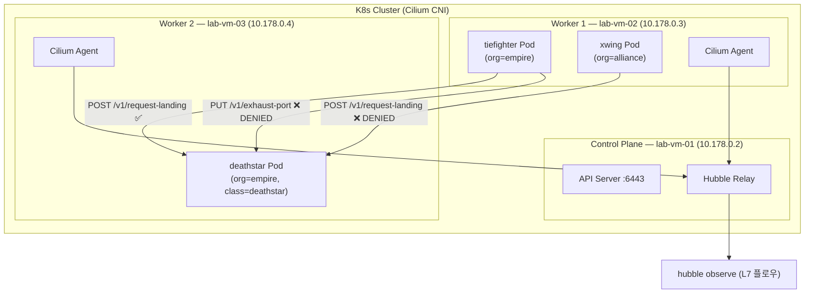

# 15. Cilium CNI & Hubble 관찰성

## 왜 이 주제인가

K8s 네트워킹의 최종 단계다. 01~14번에서 직접 구현했던 iptables DNAT, VXLAN 터널, conntrack, BGP, HA가 Cilium 안에서 어떻게 eBPF로 통합되는지 확인한다. kube-proxy를 eBPF로 대체하고, L7 NetworkPolicy로 HTTP 메서드·경로 단위 트래픽 제어를 구현한다. Hubble로 Pod 간 L7 플로우를 실시간으로 시각화해 기존 iptables 기반 방식과 비교한다.

---

## 아키텍처



### kube-proxy 대체 구조

```
기존 (kube-proxy + iptables):
  패킷 → iptables PREROUTING → conntrack → DNAT → 목적지

Cilium (eBPF):
  패킷 → BPF hook (TC/XDP) → LB map 직접 조회 → 목적지
         ↑ iptables 우회, 커널 함수 호출 없음
```

---

## 실습 환경

| VM | 내부 IP | 역할 |
|----|---------|------|
| lab-vm-01 | 10.178.0.2 | Control Plane, Cilium+Hubble 설치 |
| lab-vm-02 | 10.178.0.3 | Worker 1 (tiefighter, xwing) |
| lab-vm-03 | 10.178.0.4 | Worker 2 (deathstar) |

- Pod CIDR: `10.244.0.0/16`
- K8s 버전: 1.30
- Cilium 버전: 1.15.5

---

## 실험 방법

1. **Prerequisites 설치**: containerd + kubeadm/kubelet/kubectl (전체 3대)
2. **클러스터 초기화**: `kubeadm init --skip-phases=addon/kube-proxy` (vm-01)
3. **Worker 노드 Join**: kubeadm join 명령 실행 (vm-02, vm-03)
4. **Cilium 설치**: kube-proxy 대체 모드 + Hubble relay 활성화 (vm-01)
5. **Star Wars 데모 배포**: deathstar / tiefighter / xwing Pod
6. **L7 NetworkPolicy 적용**: org=empire 소속 + `/v1/request-landing` POST만 허용
7. **Hubble로 관찰**: 허용/차단 플로우 실시간 확인

---

## 스크립트 목록

| 파일 | 설명 | 실행 노드 |
|------|------|---------|
| `scripts/01-install-prerequisites.sh` | containerd + kubeadm 설치, XFRM 초기화 | 전체 3대 |
| `scripts/02-init-cluster.sh` | kubeadm init (kube-proxy 제외), kubeconfig 설정 | vm-01 |
| `scripts/03-join-workers.sh` | Worker 노드 Join 가이드 | vm-02, vm-03 |
| `scripts/04-install-cilium.sh` | Cilium CLI + Hubble CLI 설치, Cilium 배포 | vm-01 |
| `scripts/05-deploy-starwars.sh` | Star Wars 데모 앱 배포 및 정책 전 연결 테스트 | vm-01 |
| `scripts/06-apply-policy.sh` | CiliumNetworkPolicy L7 적용 및 검증 | vm-01 |
| `scripts/07-observe-hubble.sh` | Hubble로 L7 플로우 관찰 | vm-01 |
| `scripts/08-cleanup.sh` | 클러스터 초기화 | 전체 3대 |

---

## 핵심 개념

### Cilium & eBPF CNI

```
일반 CNI (flannel, calico iptables mode):
  Pod → veth → bridge → iptables rules → routing → 목적지

Cilium eBPF:
  Pod → veth → BPF program (TC hook) → BPF map 직접 조회 → 목적지
                                         ↑ iptables 없음
```

BPF map에는 서비스 엔드포인트, 정책, 연결 상태가 저장된다. kube-proxy가 iptables DNAT 규칙을 N개 만드는 대신, Cilium은 O(1) 해시맵 조회 한 번으로 처리한다.

### kube-proxy 대체 (kubeProxyReplacement=true)

```
ClusterIP Service 처리:
  kubeadm init --skip-phases=addon/kube-proxy
  → iptables에 Service 관련 규칙 없음
  → Cilium Agent가 BPF LB map으로 서비스 처리
  → 소켓 레벨 LB (connect() 단계에서 DNAT) 가능
```

### Hubble L7 관찰성

```
Cilium Agent → Hubble Observer (per-node)
            → Hubble Relay (클러스터 전체 집계)
            → hubble CLI / UI
```

각 Agent가 BPF 데이터 경로에서 L3/L4/L7 이벤트를 수집한다. HTTP 요청·응답, DNS 쿼리, TCP 연결 이벤트가 개별 플로우로 기록된다.

### CiliumNetworkPolicy (L7)

```yaml
# L7 정책 예시
toPorts:
- ports:
  - port: "80"
    protocol: TCP
  rules:
    http:
    - method: "POST"
      path: "/v1/request-landing"
# → POST /v1/request-landing 이외의 모든 HTTP 요청 차단
```

기존 K8s NetworkPolicy는 L3/L4(IP, Port)까지만 제어한다. CiliumNetworkPolicy는 HTTP 메서드, 경로, 헤더 단위로 세밀하게 제어한다.

### Cilium vs iptables (이전 주제 비교)

| 항목 | iptables (12번) | Cilium eBPF |
|------|-----------------|-------------|
| 룰 조회 | O(N) 선형 스캔 | O(1) 해시맵 |
| 5000 룰 RTT 증가 | +31% | ~0% |
| L7 정책 | 불가 | HTTP/gRPC/Kafka |
| 관찰성 | conntrack 로그 | Hubble L7 플로우 |

---

## 참고

- [Cilium 공식 문서](https://docs.cilium.io/)
- [Cilium Star Wars 데모](https://docs.cilium.io/en/stable/gettingstarted/demo/)
- [Hubble 관찰성](https://docs.cilium.io/en/stable/observability/hubble/)
- [kube-proxy 대체](https://docs.cilium.io/en/stable/network/kubernetes/kubeproxy-free/)
